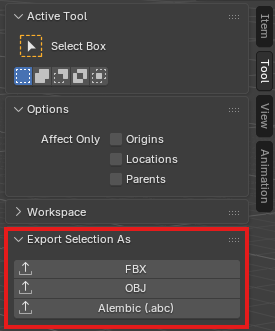
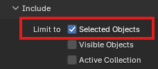
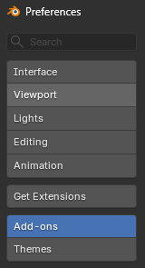
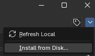
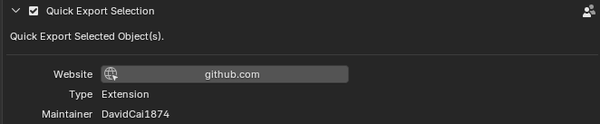

# Blender Quick Export Selection

Open the export window for selected objects with a single click.

## The Problem It Solves

Blender's "Selected Only" export option isn't enabled by default. It's easy to forget to check it and accidentally export your entire 1 GB scene. This add-on opens Blender's native export window with "Selected Only" already enabled.

## Installation

Requires Blender 4.5 or newer.

1. Download [`quick_export_selection-0.1.0.zip`](dist/quick_export_selection-0.1.0.zip) from the `dist` folder. Do not extract it.
2. In Blender, open **Edit > Preferences > Add-ons**.

   

3. Open the menu in the upper-right corner, choose **Install from Disk**, and select the ZIP file.

   

4. Enable the extension if it is not enabled automatically.
5. Enjoy!

   

## How It Works

Opens Blender's native export window with the selection-only option set to `True`.

## Planned Support

Support for additional formats, including USD and glTF, is planned.
